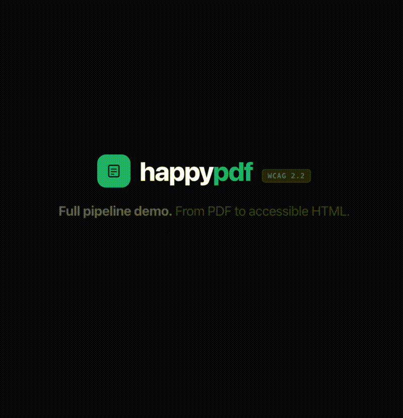

# happypdf

Convert inaccessible PDFs into **WCAG 2.2-validated** semantic HTML5 with multi-model review and iterative accessibility enhancement.

**Live Demo:** [https://happypdf.org](https://happypdf.org)

happypdf turns inaccessible PDFs into clean, semantic HTML5. It uses vision-based OCR for extraction, generates high-quality alt text, builds proper structure (landmarks, headings, tables), scores the result with axe-core in a real Chromium browser, and runs a multi-round review loop that safely enhances accessibility **without losing original content**.

## Demo


Watch happypdf transform an inaccessible PDF into WCAG 2.2 AA–validated HTML with full remediation audit trail. 

**[► Full video](https://github.com/BrendanWorks/happypdf/releases/download/v1.0/Sizzle_Video.mov)** — Available in [MP4](https://github.com/BrendanWorks/happypdf/releases/download/v1.0/happypdf-demo.mp4) (689 KB) or [MOV](https://github.com/BrendanWorks/happypdf/releases/download/v1.0/Sizzle_Video.mov) (2.8 MB)

## Table of Contents
- [Why This Exists](#why-this-exists)
- [What happypdf Does](#what-happypdf-does)
- [The Secret Sauce: True BYOK Enterprise Support](#the-secret-sauce-true-byok-enterprise-support)
- [Demo](#demo)
- [Deployment Modes](#deployment-modes)
- [Why This Project?](#why-this-project)
- [How the Pipeline Works](#how-the-pipeline-works)
- [The Enhancement & Optimization Loop](#the-enhancement--optimization-loop)
- [Benchmark Results](#benchmark-results)
- [Project Status & Roadmap](#project-status--roadmap)
- [Quick Start](#quick-start)
- [Architecture Highlights](#architecture-highlights)
- [Security](#security)
- [Known Limitations](#known-limitations)
- [Related Work](#related-work)
- [Contributing & License](#contributing--license)

## Why This Exists

PDFs remain ubiquitous in government, education, healthcare, and enterprise workflows. Many are unusable with assistive technology due to missing tags, alt text, headings, landmarks, or table structure.

Manual remediation is effective but slow, expensive, and difficult to scale. happypdf automates what can be automated, keeps every change fully auditable, and uses strict preservation checks so remediation is always additive.

## What happypdf Does

happypdf processes PDFs through a reproducible pipeline:

1. **Extract content** using olmOCR (Ai2's vision-based PDF extraction system, powered by Qwen2-VL).
2. **Generate context-aware alt text** by re-prompting Qwen2-VL on each extracted image, preserving page layout context.
3. **Build semantic HTML5** with landmarks, headings, tables, images, and stable element IDs.
4. **Score accessibility** using axe-core in a real headless Chromium browser.
5. **Review & enhance** via multi-model peer reviewers + judge model.
6. **Apply safe patches** (ARIA labels, roles, descriptions, etc.).
7. **Validate preservation** — text, images, headings, and tables are never lost.

The result is remediated, WCAG-scored HTML plus a detailed, human-readable manifest of every enhancement.

## The Secret Sauce: True BYOK Enterprise Support

Most accessibility tools force a binary choice: pay per conversion or build it yourself. happypdf offers a better path.

**Bring Your Own Keys (BYOK)** lets you use your existing Claude, ChatGPT Enterprise, or Gemini credentials. If your organization already has approved AI contracts, happypdf routes remediation through them at **no additional licensing cost**.

### Why This Matters
- **Zero new procurement friction** — Use models your security and legal teams have already approved.
- **True cost transparency** — Pay only for the compute you actually use.
- **Consistent pipeline** — The same high-quality orchestration works across hosted demo, self-hosted, and BYOK modes.

This makes happypdf uniquely practical for enterprises and government organizations.

## Demo

Try it at **[https://happypdf.org](https://happypdf.org)**.

**Features:**
- Drag-and-drop PDF upload
- Real-time pipeline progress
- Live HTML preview
- Detailed WCAG scoring and enhancement logs
- Downloadable HTML + manifest

The demo runs on Modal GPUs and excels with complex documents: forms, tables, scanned pages, image-heavy reports, and government publications.

## Deployment Modes

There is currently one reviewer pipeline: OLMo (Modal) + Gemini + GPT run together as peer reviewers, with Claude Opus as judge for LLM-safe fixes. The only thing that changes between modes is whose API credentials it uses.

| Mode | Credentials | Cost Model | Best For |
| :--- | :--- | :--- | :--- |
| **Hosted (default)** | happypdf-provisioned keys | Per conversion | Quick testing, default experience |
| **BYOK / Enterprise** | Your own Claude / OpenAI keys, swapped in for that job only | Your existing contracts | Organizations with approved AI access |

A fully open-weight, OLMo-only self-hosted mode (no Claude/GPT/Gemini calls, offline-capable) is a roadmap item — the reviewer step doesn't currently branch by mode, so it isn't available yet. See [Upcoming Features](#project-status--roadmap).

## Why This Project?

This work extends Ai2's **SciA11y** research (Wang, Cachola, et al., ASSETS '21), which achieved ~86% fidelity but highlighted three key gaps: automated alt text, table accessibility, and iterative WCAG validation. happypdf addresses all three:

- **Alt text** — Qwen2-VL generates context-aware descriptions.
- **Tables** — Robust recovery of proper `<table>`, `<th>`, etc. structure.
- **Iterative validation** — Multi-round peer review + preservation gates ensure enhancements are safe and additive.

## How the Pipeline Works




## The Enhancement & Optimization Loop

The initial HTML generator frequently produces **zero axe-core violations**. But automated tools can only detect what is *wrong*, not what is *right*. The review loop goes deeper: it verifies semantic correctness, optimizes structure, and ensures that generated descriptions (e.g., alt text) truly match the visual and contextual intent of each page.

**Each round:**
1. Peer reviewers (OLMo, Gemini, GPT-4o, etc.) analyze the HTML in parallel for improvement opportunities.
2. Judge model deduplicates suggestions, rejects unsafe changes, and classifies patches.
3. Deterministic applicator updates elements by stable `data-ir-id`.
4. Preservation gate verifies content integrity and no text/image loss.
5. axe-core rescans for any regressions.
6. Loop stops on convergence.

Typical enhancements include ARIA labels for tables, navigational roles, improved image descriptions, and better section relationships.

```

```

## Benchmark Results

All documents converge quickly with zero content loss. Manifest and report downloads verified for all PDFs.

**Core Benchmarks (3 Demos)**

| Document              | Type            | Size  | Pages | Baseline | Final  | Rounds |
|-----------------------|-----------------|-------|-------|----------|--------|--------|
| AccessComputing Syllabus | Clean digital | 1.2M | 8 | 100% (26 pass) | 100% (31 pass) | 2 |
| IRS Schedule C        | Dense form     | 1.1M | 7 | 100% (23 pass) | 100% (28 pass) | 3 |
| Navy Bulletin 1943    | OCR'd prose    | 876K | 6 | 100% (20 pass) | 100% (20 pass) | 1 |

**Extended Test Suite (10 Additional Documents)**

| Document | Type | Size | Pages | Baseline | Final | Rounds | Notes |
|----------|------|------|-------|----------|-------|--------|-------|
| Chapter 6: Assessment | Academic | 4.2M | 13 | 100% (26 pass) | 100% (26 pass) | 1 | Image-heavy extraction |
| Blood Pressure Instructions | Medical | 163K | 1 | 100% (26 pass) | 100% (26 pass) | 1 | Device manual, visuals |
| Creating a One Pager | Business | 1.3M | 5 | 100% (26 pass) | 100% (31 pass) | 2 | Mixed text & graphics |
| Dry Lab Protocol | Scientific | 1.3M | 3 | 100% (20 pass) | 100% (20 pass) | 1 | Text-heavy instructions |
| Example Document | Sample | 343K | 3 | 100% (27 pass) | 100% (32 pass) | 2 | Generic test document |
| Invoice Sample | Financial | 146K | 1 | 100% (23 pass) | 100% (28 pass) | 3 | Structured form, dense |
| Somatosensory | Scientific | 132K | 4 | 96.0% (24 pass) | 96.7% (29 pass) | 2 | Neural system reference; 1 baseline violation not resolved by round 2 |
| Cosmic Story Mat | Instructional | 447K | 6 | 100% (22 pass) | 100% (22 pass) | 1 | Children's literature, 25 embedded images; OLMo reviewer timed out then succeeded on retry |
| Furnace (Amana) | Technical | 11.9M | 16 | 96.3% (26 pass) | 96.8% (30 pass) | 2 | Appliance manual; loop stopped after round 2 when round 3 would have regressed the axe score |
| Hands-Only CPR Sheet | Medical | 219K | 1 | 100% (22 pass) | 100% (22 pass) | 1 | Emergency procedure; OLMo reviewer failed outright, loop continued with Gemini + GPT |

**Comprehensive Test Suite (13 PDFs Total)** — Full details and raw files in [`benchmark/`](benchmark/). All 13 rows above are backed by real generated output committed to the repo — no estimated or placeholder numbers.

**Key Metrics:**
- **Total PDFs tested:** 13
- **Average baseline score:** 99.4%
- **Average final score:** 99.5%
- **Average rounds to convergence:** 1.7
- **Baseline violations:** 0 violations in 11/13 documents (Somatosensory and Furnace each had 1, neither resolved by an available deterministic fix)
- **Reviewer resilience:** across 13 live runs, one reviewer failed outright once and timed-out-then-recovered once; in both cases the loop correctly continued with the remaining reviewers rather than blocking
- **Total ARIA enhancements:** 34 across the suite
- **Total test coverage:** 132 KB to 11.9 MB | 1–16 pages

## Project Status & Roadmap

**✅ Production Ready** — Fully deployed with working BYOK, benchmarks, manifest/report downloads, and security controls.

**Recently Completed (July 2026):**
- ✅ Full audit-trail JSON manifest export (with demo snapshot support)
- ✅ Formatted HTML report generation with styling
- ✅ Download package feature (JSON + HTML with proper headers)
- ✅ Comprehensive benchmark testing (13 PDFs with manifest/report verification)

**Upcoming Features:**
- Fully open-weight self-hosted mode (OLMo-only reviewers, no Claude/GPT/Gemini calls)
- Download full package ZIP (HTML output + JSON manifest + Report + Original PDF)
- CLI instance for batch processing and local runs
- Persistent job storage (Supabase) to handle long-running PDF processing
- JAWS / NVDA screen reader validation
- Batch processing dashboard
- Expanded documentation and examples

## Quick Start

### Prerequisites
- Python 3.10+
- Node.js 18+
- Modal account
- Playwright Chromium

### Installation
```bash
git clone https://github.com/BrendanWorks/happypdf.git
cd happypdf

# Install backend dependencies
pip install -r requirements.txt

# Install frontend dependencies
cd frontend && npm install && cd ..

# Install Chromium for Playwright
python -m playwright install chromium

# Set up Modal credentials
export MODAL_TOKEN_ID=your_token_id
export MODAL_TOKEN_SECRET=your_token_secret
```

### Run Locally

```bash
modal deploy src/modal_api.py

cd frontend
npm install
npm run dev
```

Run benchmarks: `python src/benchmark.py`

## Architecture Highlights

- **Stable Element IDs** (`block-{page}-{hash}`) for safe, repeatable patching.
- **Review-source agnostic** design — easily swap reviewers.
- **Security-first BYOK** — Keys never touch the browser.

## Security

### BYOK API key handling
happypdf is designed so enterprise API keys do not pass through the browser or get written to application logs.
- Keys are stored in Modal's encrypted secret vault.
- Keys are injected into backend containers as environment variables.
- The frontend never receives provider credentials.
- Error messages are sanitized to avoid leaking API responses or credentials.
- Job state is stored in memory, not in a database.

### Transport security
- Production endpoints use HTTPS.
- CORS is restricted to approved `https://` origins.
- The frontend connects directly to the Modal ASGI app.

### Data persistence
- PDF content, intermediate HTML, and remediation results live in in-memory job state.
- No database, Redis, or persistent storage is required for jobs.
- Temporary files are created with Python's `tempfile` module and deleted after processing.
- Modal containers scale down after idle periods, clearing in-memory state.

### Analytics
The hosted site (happypdf.org) uses Google Analytics (GA4) to understand traffic and usage.
- Standard GA4 data is collected: page views, device/browser info, approximate location, and first-party cookies (`_ga`, `_ga_*`).
- Custom events track pipeline usage — upload started (file size only), conversion succeeded/failed (pass count only), and BYOK used (provider name only). **No filenames, document content, or API keys are ever sent to analytics.**
- Analytics loads unconditionally on page load; there is currently no cookie-consent banner. If you're serving EU visitors and need GDPR-compliant opt-in consent, gate the GA script in `frontend/index.html` behind a consent mechanism before relying on this for compliance.
- Self-hosted deployments can remove the GA script entirely — it's a static tag in `frontend/index.html`, not wired into the pipeline.

### Self-hosting checklist
For self-hosted deployments:
1. Store `ANTHROPIC_API_KEY`, `OPENAI_API_KEY`, and `GOOGLE_API_KEY` in Modal Secrets or your own secret manager.
2. Enforce HTTPS at the ingress layer.
3. Restrict CORS origins to your production frontend domains.
4. Choose a container scale-down window that matches your security and latency needs.
5. Avoid persistent job storage unless your organization explicitly requires it.

## Known Limitations
- **axe-core is not full WCAG conformance.** Automated tools can only test part of WCAG. happypdf reports axe-core results and routes uncertain cases to human review.
- **Baseline output is often already valid.** Because the HTML generator creates semantic structure up front, the review loop often improves passes and structure rather than reducing violations.
- **Heading detection is heuristic.** Some section labels from OCR are promoted to headings, but complex document structures may still need manual review.
- **Duplicate IDs can occur on repeated visual artifacts.** Repeated separator lines or similar artifacts can produce identical hashes. The applicator fails safe when patches are ambiguous.
- **OCR quality affects output quality.** Scanned pages, low-resolution images, and complex vector graphics can reduce extraction quality.
- **Reviewer output can fail.** If a reviewer emits malformed JSON or times out, that reviewer is skipped for the round and the loop continues with available reviews.

## Related Work
- **SciA11y**: Ai2 research on converting scientific paper PDFs to accessible HTML. happypdf extends this research to general documents with iterative validation. [Paper](https://arxiv.org/abs/2105.00076v1)
- **olmOCR**: Primary extraction engine. [Paper](https://arxiv.org/abs/2502.18443)

## Contributing & License

Pull requests are welcome — see [`CONTRIBUTING.md`](CONTRIBUTING.md) for setup, branch, and code-style conventions. For major changes, please open an issue first.

Questions or bugs: [open a GitHub issue](https://github.com/BrendanWorks/happypdf/issues).

**License:** [MIT](LICENSE)
